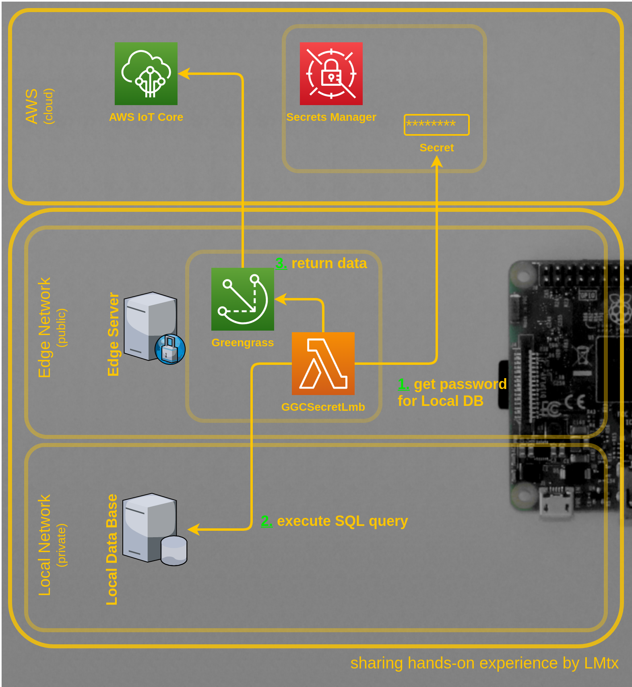
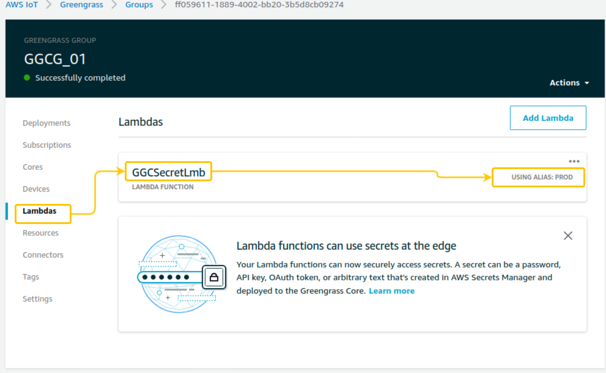
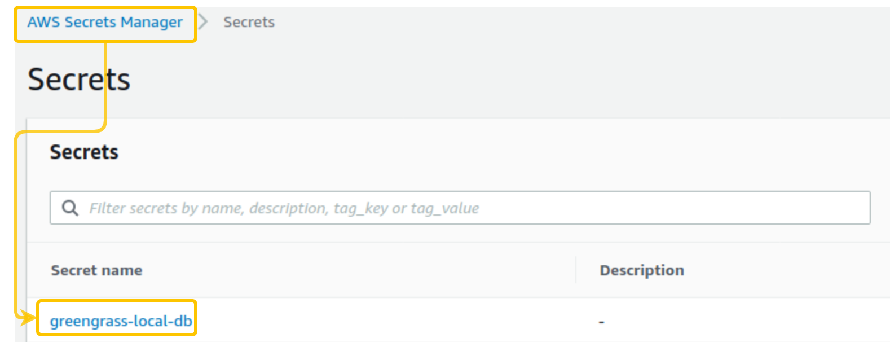
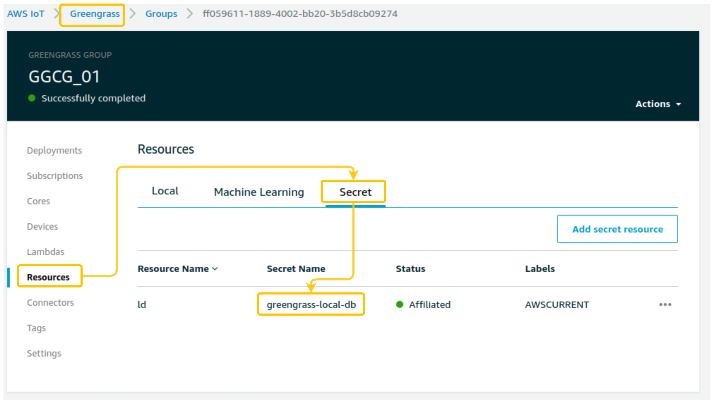
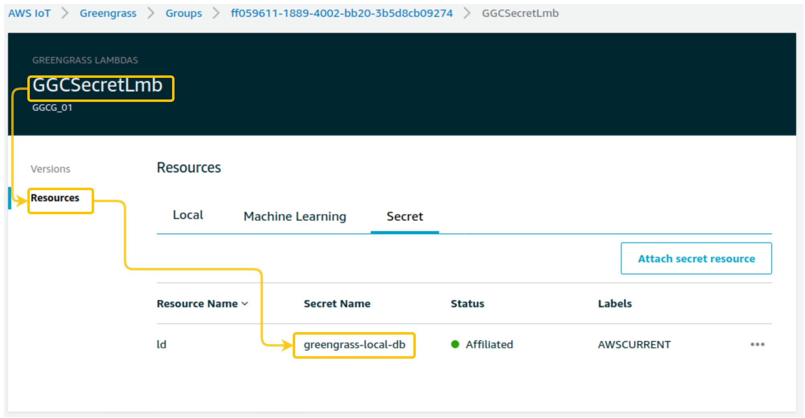
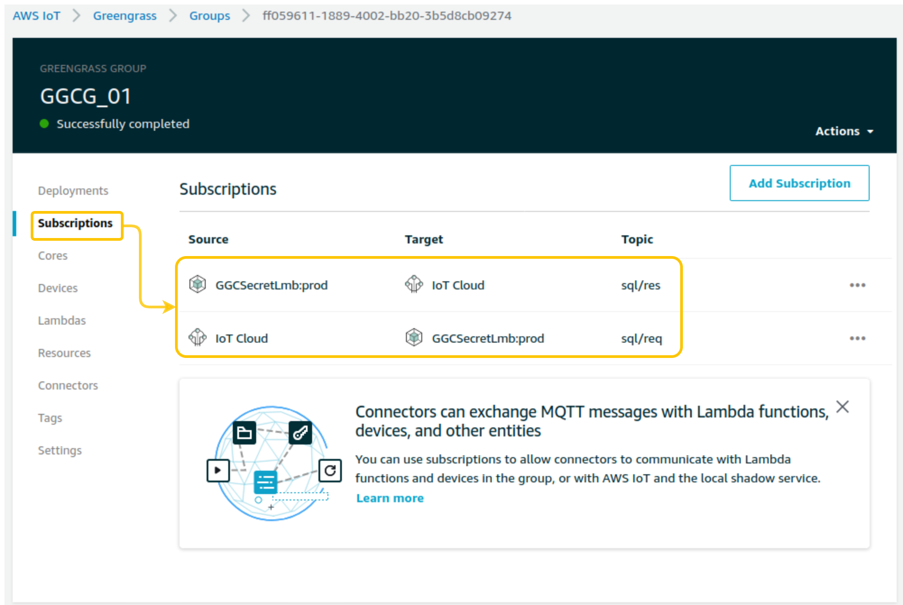
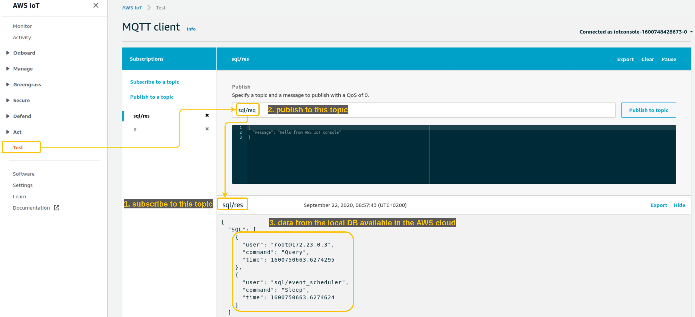

# Introduction

In this post I will present a solution for the following business Use Case:

## Business Use Case

Obtain data from a local Data Base running on isolated network without access to the public internet.

Additional requirements:
* do not store the password to the local Data Base as a clear text at any point in time
* do not share the password to the local Data Base with developers
* encrypt data during transfer to the cloud

## Solution

In order to realize the above Business Use Case and meet additional requirements we will build a solution presented below:



To setup the local development environment we will use docker-compose [template](docker/docker-compose.yml) containing following definitions:
* Greengrass Core container attached to both public and private network emulate service deployed at the Edge Server,
* MySQL container running on an internal docker network will emulate a Data Base server without access to the internet.

Greengrass Core will receive encrypted credentials from AWS Secrets Manager and store them securely on the Edge Server. Please check my [twitter post](https://twitter.com/lmtx1/status/1306603356882862080?s=20) for additional details.

Obtained credentials will allow the Lambda function running at the Greengrass Core to log into the local Data Base and execute SQL query.

Received data will be returned in a secure way to AWS IoT Core.

# Details

## AWS SAM Template

Lambda function running at the Greengrass Core device is created using AWS SAM [template](ggc-lambda-function/template.yaml).

Setting runtime to `python3.7` is important because that version of python3 is supported by Greengrass Core at this time (this might change in the future).

`AutoPublishAlias: prod` is used to automatically create an alias and publish an updated version of a Lambda function. In order to avoid Greengrass Group configuration updates, you can specify a Lambda alias instead of a specific Lambda version (this way updated versions of this function are going to be pointed by the same alias).



## Secrets Manager

The password for the local Data Base is going to be stored in AWS Secrets Manager (a service that is designed to manage passwords in a secure way).



## Greengrass Group

### Secret Resource

Secret Resource in Greengrass Group points to the password for the local Data Base stored in Secrets Manager service. This encrypted secret is going to be part of the Greengrass Group Deployment (will be transferred to Greengrass Core device).



### Lambda



Lambda function running at the Greengrass Core is configured as affiliated with Secret - this allows it to access password stored in this Secret and use it to log into the local Data Base.


```python
# read secret
resp = sm_client.get_secret_value(SecretId='greengrass-local-db')
secret = resp.get('SecretString')

...

sec = json.loads(secret)

# connect to local DB using obtained secret
cnx = mysql.connector.connect(user='root',password=sec["db_pass"], host='db',port=3306, database='sys')
```

Full [source code](./ggc-lambda-function/gglcsecret-func/app.py) of this Lambda.

### Subscriptions

Following Subscriptions are configured:



Lambda function is going to be invoked by sending a message to `sql/req` topic and it will return obtained data in a message send to `sql/res` topic.



Disclaimer: in actual solution this might or might not be the desired implementation - I used MQTT topics to clearly present the end to end flow of data.

# Summary

I hope that you will find the above solution useful.

Create an issue in case of any questions and consider following me on [twitter](https://twitter.com/lmtx1) if you are interested in AWS and IoT topics.

# Useful links

[AWS Greengrass documentation](https://docs.aws.amazon.com/greengrass/latest/developerguide/what-is-gg.html)

[AWS Secrets Manager documentation](https://docs.aws.amazon.com/secretsmanager/latest/userguide/intro.html)

[AWS Serverless Application Model (SAM)](https://docs.aws.amazon.com/serverless-application-model/latest/developerguide/what-is-sam.html)

[AWS IoT Greengrass Core Python SDK](https://github.com/aws/aws-greengrass-core-sdk-python)

[Docker Compose](https://docs.docker.com/compose/)